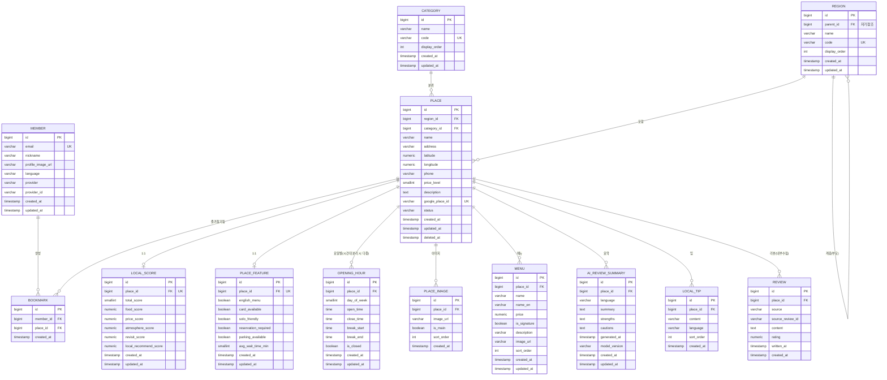

# ERD 설계 — Real Korea Travel (MVP)

> 버전: 0.1 / 대상: MVP (서울 성수, 홍대, 강남, 명동)

## 1. ERD 다이어그램

## 2. 엔티티 상세

### member — 회원
| 컬럼 | 타입 | 제약 | 설명 |
|---|---|---|---|
| id | BIGINT | PK, AUTO_INCREMENT | |
| email | VARCHAR(255) | UNIQUE, NOT NULL | |
| nickname | VARCHAR(50) | | |
| profile_image_url | VARCHAR(500) | | Google 프로필 이미지 |
| language | VARCHAR(10) | DEFAULT 'en' | 앱 언어 (en, ja, zh, es) |
| provider | VARCHAR(20) | DEFAULT 'GOOGLE' | OAuth 제공자 |
| provider_id | VARCHAR(255) | NOT NULL | Google sub ID |
| created_at / updated_at | TIMESTAMPTZ | NOT NULL | |

### region — 지역 (계층형)
| 컬럼 | 타입 | 제약 | 설명 |
|---|---|---|---|
| id | BIGINT | PK | |
| parent_id | BIGINT | FK → region.id, NULL 허용 | 도시(서울) → 구역(성수) 계층 |
| name | VARCHAR(50) | NOT NULL | 성수, 홍대, 강남, 명동 |
| code | VARCHAR(50) | UNIQUE, NOT NULL | seongsu, hongdae, ... |
| display_order | INT | DEFAULT 0 | 노출 순서 |
| created_at / updated_at | TIMESTAMPTZ | | |

### category — 카테고리
| 컬럼 | 타입 | 제약 | 설명 |
|---|---|---|---|
| id | BIGINT | PK | |
| name | VARCHAR(50) | NOT NULL | 맛집, 카페, 디저트, 술집 |
| code | VARCHAR(50) | UNIQUE, NOT NULL | restaurant, cafe, dessert, bar |
| display_order | INT | DEFAULT 0 | |
| created_at / updated_at | TIMESTAMPTZ | | |

### place — 장소
| 컬럼 | 타입 | 제약 | 설명 |
|---|---|---|---|
| id | BIGINT | PK | |
| region_id | BIGINT | FK → region.id, NOT NULL | |
| category_id | BIGINT | FK → category.id, NOT NULL | MVP는 단일 카테고리 |
| name | VARCHAR(100) | NOT NULL | |
| address | VARCHAR(255) | NOT NULL | |
| latitude / longitude | NUMERIC(10,7) | | |
| phone | VARCHAR(30) | | |
| price_level | SMALLINT | 1~4 | ₩ ~ ₩₩₩₩ |
| description | TEXT | | |
| google_place_id | VARCHAR(255) | UNIQUE | Google Places 연동 키 |
| status | VARCHAR(20) | DEFAULT 'ACTIVE' | ACTIVE / CLOSED / HIDDEN |
| created_at / updated_at | TIMESTAMPTZ | | |
| deleted_at | TIMESTAMPTZ | NULL | soft delete |

### opening_hour — 운영시간 (요일별, 시간대 분리 시 여러 행)
| 컬럼 | 타입 | 제약 | 설명 |
|---|---|---|---|
| id | BIGINT | PK | |
| place_id | BIGINT | FK → place.id, NOT NULL | |
| day_of_week | SMALLINT | 1=MON ~ 7=SUN | |
| open_time / close_time | TIME | NOT NULL, close > open | |
| is_closed | BOOLEAN | DEFAULT false | 휴무일 |
| created_at / updated_at | TIMESTAMPTZ | | |
| **UNIQUE** | | (place_id, day_of_week, open_time, close_time) | 동일 시간대 중복 방지 |

> 같은 요일에 시간대가 분리되면(예: 오전 9~13, 저녁 17~24) **여러 행으로 저장**한다.

### place_image — 장소 이미지
| 컬럼 | 타입 | 제약 | 설명 |
|---|---|---|---|
| id | BIGINT | PK | |
| place_id | BIGINT | FK | |
| image_url | VARCHAR(500) | NOT NULL | S3 URL |
| is_main | BOOLEAN | DEFAULT false | 대표 이미지 |
| sort_order | INT | DEFAULT 0 | |
| created_at | TIMESTAMPTZ | | |

### menu — 메뉴
| 컬럼 | 타입 | 제약 | 설명 |
|---|---|---|---|
| id | BIGINT | PK | |
| place_id | BIGINT | FK | |
| name | VARCHAR(100) | NOT NULL | 한글 메뉴명 |
| name_en | VARCHAR(100) | NULL | MVP는 필드로 다국어 대응 |
| price | NUMERIC(10,0) | NOT NULL | 원 단위 |
| is_signature | BOOLEAN | DEFAULT false | 추천 메뉴 (Local Tip과 연동) |
| description | VARCHAR(500) | | |
| image_url | VARCHAR(500) | | |
| sort_order | INT | DEFAULT 0 | |
| created_at / updated_at | TIMESTAMPTZ | | |

### local_score — 현지인 점수
| 컬럼 | 타입 | 제약 | 설명 |
|---|---|---|---|
| id | BIGINT | PK | |
| place_id | BIGINT | FK, **UNIQUE** | 1:1 |
| total_score | SMALLINT | 0~100 | 계산값: 5개 지표 평균 |
| food_score | NUMERIC(4,1) | 0~100 | 음식 만족도 |
| price_score | NUMERIC(4,1) | 0~100 | 가격 만족도 |
| atmosphere_score | NUMERIC(4,1) | 0~100 | 분위기 |
| revisit_score | NUMERIC(4,1) | 0~100 | 재방문 의향 |
| local_recommend_score | NUMERIC(4,1) | 0~100 | 현지인 추천도 |
| created_at / updated_at | TIMESTAMPTZ | | |

> `total_score = (food + price + atmosphere + revisit + local_recommend) / 5`

### place_feature — 편의 정보
| 컬럼 | 타입 | 제약 | 설명 |
|---|---|---|---|
| id | BIGINT | PK | |
| place_id | BIGINT | FK, **UNIQUE** | 1:1 |
| english_menu | BOOLEAN | DEFAULT false | 영어 메뉴 |
| card_available | BOOLEAN | DEFAULT true | 카드 결제 |
| solo_friendly | BOOLEAN | DEFAULT false | 혼밥 가능 |
| reservation_required | BOOLEAN | DEFAULT false | 예약 필요 |
| parking_available | BOOLEAN | DEFAULT false | 주차 |
| avg_wait_time_min | SMALLINT | DEFAULT 0 | 평균 웨이팅(분) |
| created_at / updated_at | TIMESTAMPTZ | | |

### ai_review_summary — AI 리뷰 요약
| 컬럼 | 타입 | 제약 | 설명 |
|---|---|---|---|
| id | BIGINT | PK | |
| place_id | BIGINT | FK | |
| language | VARCHAR(10) | DEFAULT 'en' | |
| summary | TEXT | | 핵심 요약 |
| strengths | TEXT | | 장점 (리스트/JSON) |
| cautions | TEXT | | 주의사항 (웨이팅 등) |
| generated_at | TIMESTAMPTZ | | GPT 호출 시각 |
| model_version | VARCHAR(50) | | gpt-5.5 |
| created_at / updated_at | TIMESTAMPTZ | | |
| **UNIQUE** | | (place_id, language) | 언어별 재생성(upsert) |

### local_tip — 현지인 팁
| 컬럼 | 타입 | 제약 | 설명 |
|---|---|---|---|
| id | BIGINT | PK | |
| place_id | BIGINT | FK | |
| content | VARCHAR(500) | NOT NULL | e.g. "양념갈비는 '웨이팅 없이' 화요일 방문 추천" |
| language | VARCHAR(10) | DEFAULT 'en' | |
| sort_order | INT | DEFAULT 0 | |
| created_at | TIMESTAMPTZ | | |

### bookmark — 즐겨찾기
| 컬럼 | 타입 | 제약 | 설명 |
|---|---|---|---|
| id | BIGINT | PK | |
| member_id | BIGINT | FK | |
| place_id | BIGINT | FK | |
| created_at | TIMESTAMPTZ | | |
| **UNIQUE** | | (member_id, place_id) | 중복 저장 방지 |

### review — 리뷰 소스 (내부 수집용)
| 컬럼 | 타입 | 제약 | 설명 |
|---|---|---|---|
| id | BIGINT | PK | |
| place_id | BIGINT | FK | |
| source | VARCHAR(50) | NOT NULL | NAVER, KAKAO, GOOGLE |
| source_review_id | VARCHAR(255) | NOT NULL | 원본 ID |
| content | TEXT | | AI 요약의 입력 데이터 |
| rating | NUMERIC(2,1) | 0~5 | |
| written_at | TIMESTAMPTZ | | 원본 작성일 |
| created_at | TIMESTAMPTZ | | |
| **UNIQUE** | | (source, source_review_id) | 중복 수집 방지 |

> PRD에서 "사용자 리뷰 작성"은 제외되지만, AI 리뷰 요약의 입력 데이터를 위해 내부 수집 테이블로 포함. 외부 노출 없음.

## 3. 관계 요약

| 관계 | 유형 | 설명 |
|---|---|---|
| region → place | 1:N | 지역은 여러 장소 포함 |
| category → place | 1:N | 카테고리는 여러 장소 분류 (MVP) |
| place → opening_hour | 1:N | 요일별, 시간대 분리 시 여러 행 |
| place → place_image | 1:N | |
| place → menu | 1:N | |
| place → local_score | 1:1 | |
| place → place_feature | 1:1 | |
| place → ai_review_summary | 1:N | 언어별 |
| place → local_tip | 1:N | |
| place → review | 1:N | 내부 수집 |
| member → bookmark | 1:N | |
| place → bookmark | 1:N | |
| region → region | 자기참조 | 도시 > 구역 |

## 4. 인덱스 & 제약

### 현재 (RKT-11 V1에 포함)
| 대상 | 종류 | 설명 |
|---|---|---|
| place | BTREE (google_place_id) | UNIQUE 제약 |
| ai_review_summary | UNIQUE (place_id, language) | |
| opening_hour | UNIQUE (place_id, day_of_week, open_time, close_time) | |
| bookmark | UNIQUE (member_id, place_id) | |

### 나중에 추가 (도메인 구현 티켓 RKT-18~20에서 필요 시)
| 대상 | 종류 | 설명 |
|---|---|---|
| place | BTREE (region_id, category_id, status) | 지역+카테고리 필터 목록 조회 |
| place | GIN (search_vector) | Full Text Search (PostgreSQL tsvector) |
| bookmark | BTREE (member_id) | 즐겨찾기 목록 조회 |
| menu | BTREE (place_id, is_signature) | 추천 메뉴 조회 |

## 5. 설계 결정 사항 (Design Decisions)

1. **Place → Category 단일 카테고리 (1:N)**
   - MVP 필터링 단순화를 위해 단일 카테고리 사용.
   - 추후 "술집이자 맛집" 등 다중 분류 필요 시 `place_category` 조인 테이블로 확장.

2. **Region 자기참조 계층 구조**
   - `서울(부모) > 성수(자식)` 구조로 부산, 제주, 전국 확장 시 데이터 변경 없이 지역 추가만으로 대응.

3. **요일별 운영시간 분리 (시간대 다중 행)**
   - `opening_hour` 테이블로 정규화. 휴무일(is_closed), 시간대 분리(오전/오후/저녁)를 행 단위로 표현.
   - 같은 요일이면 여러 행 저장 가능, `(place_id, day_of_week, open_time, close_time)` 유니크로 중복 방지.
   - PRD의 단일 `openingHours` 필드 대체.

4. **LocalScore / PlaceFeature는 Place와 1:1**
   - 변경 이력 보존이 필요해지면 `_history` 테이블 또는 버전 컬럼으로 확장.

5. **다국어 전략 (MVP → 확장)**
   - MVP: `menu.name_en`, `ai_review_summary.language`, `local_tip.language` 등 필드/행 단위로 대응.
   - 확장: `place_translation(name, description)` 별도 테이블 도입.

6. **AI 요약은 언어별 upsert**
   - (place_id, language) 유니크로 재생성 시 갱신. `model_version`으로 회귀 방지.

7. **soft delete**
   - `place.deleted_at`으로 관리. 삭제 후에도 북마크·통계 데이터 무결성 유지.

8. **Local Score는 계산값**
   - 5개 지표의 평균으로 `total_score` 산출. 지표 가중치 변경 시 애플리케이션에서 계산.

9. **Google Places 연동**
   - `google_place_id` UNIQUE로 장소 ID 매핑. 위경도·이미지 동기화의 기준 키.

## 6. 향후 확장 (비-MVP)

| 엔티티 | 시점 | 설명 |
|---|---|---|
| place_category (M:N) | v1.x | 다중 카테고리 |
| place_translation | v1.x | 다국어 장소명/설명 |
| local_score_history | v2.0 | 점수 변경 이력 |
| hashtag / tag | v1.x | 커뮤니티 기능 대비 |
| featured_place (큐레이션) | v1.x | 홈 추천 장소 관리 |
| travel_plan | v2.0 | AI 여행 일정 생성 |
